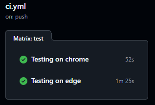

# Documentation

- I tried to develop this project as close as possible to a 'real' project and not only follow the requirements in the slides.
- The project uses Cucumber, JUnit and GithubActions to run all tests parallel on two browsers.
- I also wrote POMs for RegisterPage and ConfirmationPage, to improve test readability.

<br/>

**Scenarios explained:**
```
Background: I fill in every required field in the registration
  - Fills in all fields and checks the required checkboxes


Scenario Outline: I leave every field is empty once and get correct errors
  - Empties one of the fields at a time for all fields in the registration and expects errors
    
    Example:
        - Fills in all fields via Background
        - Empties Surname field
        - Presses to Continue
        - Gets error "Last Name is required"
    
        -> Fullfils requirement: Spaka användare - efternamn saknas


Scenario Outline: I type invalid passwords and get correct errors
  - Types different types of invalid scenarios in the ConfirmPassword field
    
    Example:
        - Fills in all fields via Background (Password field = 'test1')
        - Fills in ConfirmPassword with 'test2'
        - Presses to Continue
        - Gets error "Password did not match"
    
        -> Fullfils requirement: Spaka användare - lösenord matchar inte


Scenario: I don't check the ToS checkbox and get correct error

    Example:
        - Fills in all fields via Background
        - Leaves the ToS unchecked
        - Presses to Continue
        - Gets error "You must confirm that you have read and accepted our Terms and Conditions"
        
        -> Fullfils requirement: Spaka användare - terms and conditions är inte godkänt


Scenario: I create a user successfully
  - Self explanatory :)
  
    -> Fullfils requirement: Spaka användare - allt går som förväntat
```

- Every `Then` contains a JUnit assert to verify the expected behavior

<br>

Cross browser testing runs with the help of GithubActions:
```
jobs:
  test:
    name: Testing on ${{ matrix.browser }}
    runs-on: ubuntu-latest

    strategy:
      matrix:
        browser: [ chrome, edge ]

    env:
      BROWSER: ${{ matrix.browser }}

```
<br/>

## Running tests
Currently there's a Workflow that runs on every PR to Master or push to Master or `feature/**` branches.   
Alternatively you can run Cucumber tests via IntelliJ (will not run cross-browser though, only Chrome).
- Checkout the repository
- Run `mvn clean install`
- ???
- Profit!

### How it works
Github runs `mvn clean install`. This calls `TestRunner.java`, which runs all Feature files under `resources/features`. 
Before any Scenario, `Hooks` is called and its `@Before` tag calls `DriverManager.setBrowser(browser);`. 
`browser` is fetched from the Github's environment property, as in `System.getenv("BROWSER");`.
From there, `DriverManager` performs a browser setup like `WebDriverManager.chromedriver().setup();`, with additional headless options like `"--headless", "--disable-gpu"`. 
Now that the driver is set up, `MyStepsdef.java` runs normally with the assistance of POM `RegisterPage` for cleaner readability.

 

## Final result 
```
===============================================
[INFO] Results:
[INFO] Tests run: 11, Failures: 0, Errors: 0, Skipped: 0
===============================================
```
